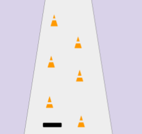

## Create obstacles

<div style="display: flex; flex-wrap: wrap">
<div style="flex-basis: 200px; flex-grow: 1; margin-right: 15px;">
Create the obstacles that you will have to avoid to keep playing the game.
</div>
<div>

</div>
</div>

Your obstacles will be made from shapes in processing. Can you make them out of a combination of shapes or just one shape? How do the obstacles fit with your theme?

--- task ---

**Choose:** what colours you will use for your obstacles. Add new colour variables to the `setup()` function.

[[[generic-theory-simple-colours]]]

--- /task ---

What shape(s) will your obstacles be?

--- task ---

Create a function that will draw your obstacles. This function should take the (x, y) coordinates of the obstacle as parameters.

--- collapse ---
---
title: Create a filled in shape
---

To fill a shape, use the `fill()` function with a colour. Remember you can use `no_fill()` to turn your fill off.

```python
fill(100, 200, 50)
ellipse(160, 220, 50, 50)
```

--- /collapse ---

[[[processing-python-ellipse]]]

[[[processing-python-rect]]]

[[[processing-python-triangle]]]

**Tip:** You can use several simple shapes in the same function to create a more complex obstacle (like the trees in the example Skiing project).


--- /task ---

Repeating code to place enough obstacles for the game would be time consuming and inefficient. 

To solve this, you could use a `for` loop with `randint()` to choose obstacle positions for you, however, because `randint()` will start from a new number in every frame, your obstacles change position each frame.

If you use the `seed()` function first, you can avoid the obstacles jumping around.

--- task ---

Write a function that will draw your obstacle multiple times in the game, in random co-ordinates. Call this function in `draw()`, so it runs in every frame.

[[[using-seed-in-python]]]

[[generic-python-for-loop-repeat]]

--- save ---

--- /task ---

--- task ---

--- collapse ---
---
title: **Epilepsy Warning:**
---

Testing your program has the potential to induce seizures for people with photosensitive epilepsy. If you have photosensitive epilepsy or feel you may be susceptible to a seizure, do not run your program. You can
- Ask somebody to run it for you
- Move on and complete the project, asking someone to run the project for you at the end so you can debug.
- Change the frame rate before you run your program by adding `frame_rate(1)` at the start of `setup()` — you can remove this once you have confirmed there is no bug

--- /collapse ---

**Test:** Run your program and check your obstacles all stay in the same place, rather than changing position every time a frame is drawn.

--- /task ---

--- task ---

**Debug:** You might find some bugs in your project that you need to fix. Here are some common bugs.

--- collapse ---
---
title: I am having trouble with the colour of my shapes
---

Make sure that, if you have variables for colour, they are defined as global variables.

```python
def setup():    
    global BLACK, WHITE
    BLACK = (0,0,0)
    WHITE = (255,255,255)
```

--- /collapse ---

--- collapse ---
---
title: Only one obstacle is being drawn
---

Check that your function to draw multiple obstacles is:
 + using a `for` loop to call the obstacle drawing function more than once
 + using `randint()` to change the (x, y) coordinates it is passing to the obstacle drawing function

For example:

```python
def draw_obstacles():
  # Use seed to get the same random numbers each frame
  seed('my random seed')

  # Randomly choose the number of obstacles to draw
  obstacle_count = randint(10, 30)

  # Running the obstacle positioning code in a loop
  for obstacle in range(obstacle_count):
    
    # Pick an x coordinate at random
    x_coord = randint(1, 400)
    
    # Pick a y coordinate at random
    y_coord = randint(1, 400)

    # Call your function to drawn an obstacle
    draw_obstacle(x_coord, y_coord)
```

--- /collapse ---

--- collapse ---
---
title: The obstacles are changing position every time a frame is drawn
---

Make sure that you have used `seed()` inside the function that draws multiple obstacles.

--- /collapse ---

--- /task ---
